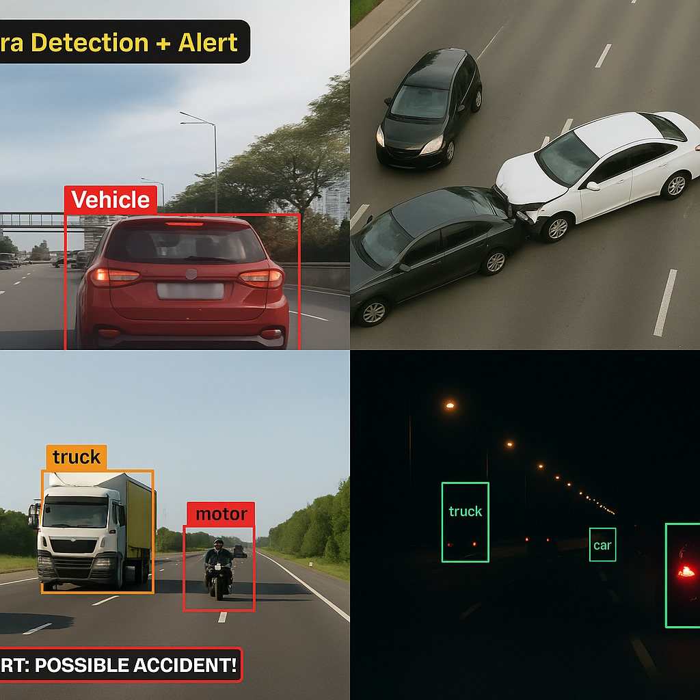

# AI-Based Accident Detection System

## Overview
This project is an **AI-based real-time vehicle detection and accident prediction system**.  
It uses **YOLOv8** and **OpenCV** to detect vehicles in a video stream and can be extended to predict potential accidents, helping reduce emergency response time.

## Features
- Real-time vehicle detection (cars, bikes, trucks, buses)
- Annotates vehicles with bounding boxes
- Can be extended to detect risky behavior and collisions
- Working prototype included in Python

## Tech Stack
- Python
- OpenCV
- Ultralytics YOLOv8
- NumPy
## How to Run

1. **Clone the repository**:
```bash
git clone https://github.com/saraswathipamidi/Accident-Detection-AI.git
```

2. **Navigate to the project folder**:
```bash
cd Accident-Detection-AI
```

3. **Install dependencies**:
```bash
pip install -r requirements.txt
```

4. **Run the Python script**:
```bash
python vehicle_detection.py
```

A window will open showing the **sample video with detected vehicles**.

## Demo Output


## Live Demo GIF
Coming soon... 🚀

## Project Structure
Accident-Detection-AI/
│── vehicle_detection.py        # Main script for vehicle detection
│── requirements.txt            # Dependencies
│── sample_video.mp4            # Sample traffic video
│── demo_output.jpg             # Demo image
│── README.md                   # Project documentation
│── models/                     # (Optional) YOLO model files
│── utils/                      # Helper functions (future expansion)


